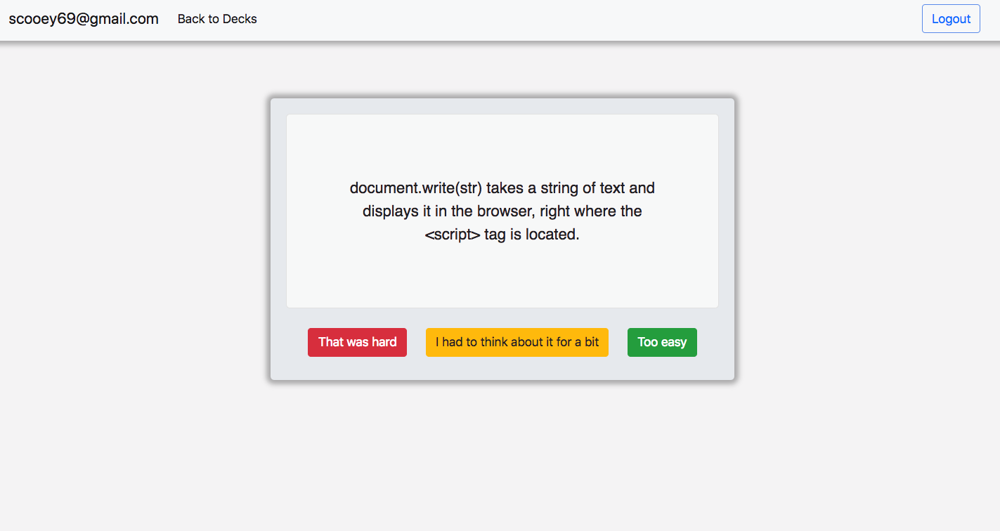

# Flashy

[https://cdcasey.github.io/flashy/]

Flash card apps can be a great way to keep information fresh in your head as you're trying to learn it. Popular apps like Anki use [space repitition](https://en.wikipedia.org/wiki/Spaced_repetition) to help reinforce learning further. However, Anki does not have a great user interface. Other apps that have better interfaces either do not used spaced repitiion or the spaced repitition features are difficult to use. Flashy's goal is to use good spaced repitition features by default while having a pleasing user experience.

## Stack

Flashy was written in HTML, CSS, and Javascript. Firebase was used for log in and data persistence. [spaced-repetition](https://www.npmjs.com/package/spaced-repetition) was used to handle the spaced repitition tasks.

## Challenges

This was my first time using Firebase. As I would learn something new about it, I would excitedly add it to the Javascript in my code file. A few days in I realized that my code was becoming disorganized and unmaintainable. Probably the best decision that I made during the creation of this app was to reorganize the Javascript code into an MVC pattern. It's still not perfect (there's some code that could be moved from the controller to the model), but overall things are much easier to read and maintain. 

## Things to change

* the UI could use a refresh
* there should be a way to add decks
* there should be a way for a user to delete a deck from their set of decks
* cards should be presented in random order
* Some styling for things like bold, italics, and monospace text

Also, I'm not sure a flat database is the best tool for this app. Currently a deck is copied into a user's deck area once a user selects a deck to study. At the very least users should have a way to update their own decks based on any updates that were made to global decks without losing their progress. The flat DB DOES make it easy to keep track of user progress by deck.

